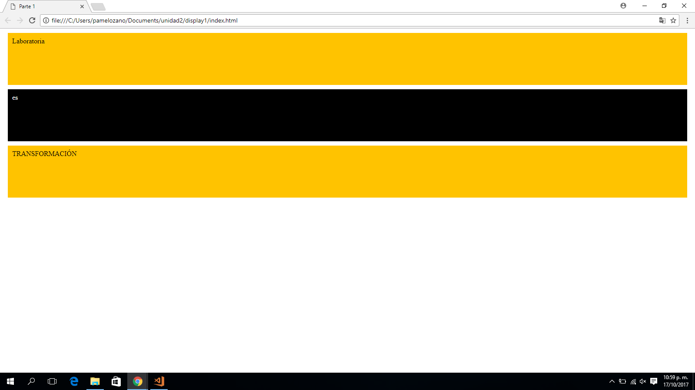

## PARTE 1

### DISPLAY BLOQUE
Este repositorio contiene un proyecto de banderas trabajado con __**(display bloque)**__ ya que ocuparemos todo el espacio del navegador.

### Recordemos:
* La propiedad **"display"** es la propiedad más importante para __controlar estructuras__.
* Cada **elemento tiene un valor de display por defecto** dependiendo de qué tipo de elemento sea.
* El valor por defecto para la mayoría de los elementos es usualmente **block** (de bloque) o **inline** (en línea).
* Los elementos de bloque **respetan los anchos y altos y los márgenes verticales.**

### Pondremos en práctica lo siguiente:
1. Aplicaremos **selectores:**
    * Selector de elemento: **div**
    * Selector de clases: atributo **class**

2. Aplicaremos __"elementos que componen el modelo de caja"__
    * Padding **(relleno)**.
    * Margin **(margen)**

3. Aplicaremos la __"propiedad de los elementos de caja""__
    * display **(por bloques)**
    * background-color **(Color al bloque)**
    * color **(para el contenido)**

### Herramientas Utilizadas:
1. HTML
2. CSS3

### Imagen final:

